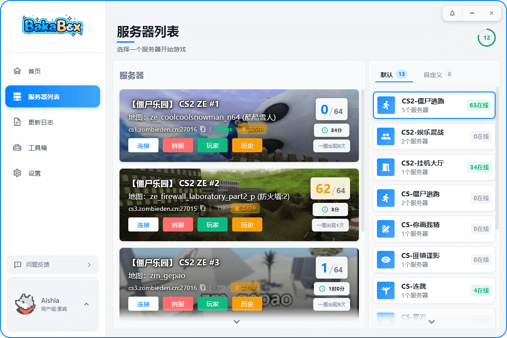

<div align="center">
  

  <h3>BakaBox</h3>

  <p>
    CS2 Launcher
  </p>

  <p>
    <a href="https://github.com/CrimsonAishia/BakaBox-Source/graphs/contributors"></a>
    <a href="https://github.com/CrimsonAishia/BakaBox-Source/network/members"></a>
    <a href="https://github.com/CrimsonAishia/BakaBox-Source/stargazers"></a>
    <a href="https://github.com/CrimsonAishia/BakaBox-Source/issues"></a>
    <a href="https://github.com/CrimsonAishia/BakaBox-Source/blob/main/LICENSE"></a>
  </p>

  <p>
    <strong>English</strong> · <a href="README_zh.md">简体中文</a>
  </p>

  <p>
    <a href="https://baka.aishia.cc/"><strong>Visit Official Website »</strong></a> ·
    <a href="https://github.com/CrimsonAishia/BakaBox-Source/issues">Report Bug</a> ·
    <a href="https://github.com/CrimsonAishia/BakaBox-Source/issues">Request Feature</a>
  </p>
</div>

<div align="center">
  
</div>

## Table of Contents

- [Getting Started](#getting-started)
  - [Prerequisites](#prerequisites)
  - [Installation](#installation)
- [Project Structure](#project-structure)
- [Built With](#built-with)
- [Deployment and Build](#deployment-and-build)
- [Version Control](#version-control)
- [Author](#author)

### Getting Started

#### Prerequisites

1. Flutter SDK >= 3.9.0
2. Dart SDK >= 3.0.0
3. (Windows only) Visual Studio 2022 with C++ Desktop Development workload

#### Installation

1. Clone the repo
```sh
git clone https://github.com/CrimsonAishia/BakaBox-Source.git
```
2. Get dependencies
```sh
flutter pub get
```
3. Run the app
```sh
flutter run -d windows
```

### Project Structure

```text
BakaBox/
├── lib/
│   ├── app/             # Application layer wrapper
│   ├── core/            # Core business logic (API/BLoC/Models/Router)
│   ├── desktop/         # Desktop-specific implementation (Windows)
│   ├── mobile/          # Mobile-specific implementation
│   ├── web/             # Web support layer
│   └── main.dart        # Entry point
├── proto/               # Protobuf definition files
├── windows/             # Native Windows project & MSIX config
├── android/             # Native Android project
├── ios/                 # Native iOS project
├── web/                 # Native Web project
├── assets/              # Static assets (icons, localization, etc.)
├── generate_proto.bat   # Protobuf one-click compilation script
└── pubspec.yaml         # Dependencies configuration
```

### Built With

- [Flutter](https://flutter.dev/) - Cross-platform UI framework
- [flutter_bloc](https://bloclibrary.dev/) - State management
- [go_router](https://pub.dev/packages/go_router) - Routing
- [dio](https://pub.dev/packages/dio) - HTTP client
- [Nakama](https://heroiclabs.com/) - Realtime backend interaction
- [Flame](https://flame-engine.org/) - 2D game engine integration
- [sherpa_onnx](https://github.com/k2-fsa/sherpa-onnx) - Offline TTS (Text-to-Speech)

### Deployment and Build

As a standard Flutter cross-platform project, the open-source branch does not include private CI/CD automation scripts. You can build and package the application directly using standard Flutter commands.

#### 1. Desktop (Windows)
The desktop version can be built as a standard portable Windows executable or packaged as an MSIX installer for the Microsoft Store.

```sh
# 1. Build a standard Windows executable (outputs to build/windows/runner/Release)
flutter build windows

# 2. (Optional) Build an MSIX installer for distribution
flutter pub run msix:create
```

#### 2. Mobile (Android / iOS)
```sh
# Android: Build APK (outputs to build/app/outputs/flutter-apk/app-release.apk)
flutter build apk

# iOS: Build (requires macOS and properly configured certificates in Xcode)
flutter build ios
```

### Version Control

This project uses Git for version management. You can refer to the repository for current available versions.

### Author

Aishia Studio 
- Github: [@CrimsonAishia](https://github.com/CrimsonAishia)
